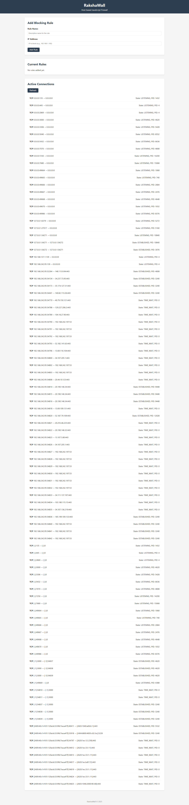

# Rakshawall 🔥🧱

## A lightweight host-based firewall built with JavaScript (Node.js) to monitor and control network traffic. It supports IP blocking, port filtering, and rule-based security for Windows, Linux, and macOS. Easily deployable as a standalone executable (.exe/.bin) without requiring Node.js.

## Rakshawall UI Preview

#### Learning project of Linux(collage) Requested by firend 👨🏻‍💻☕🧋